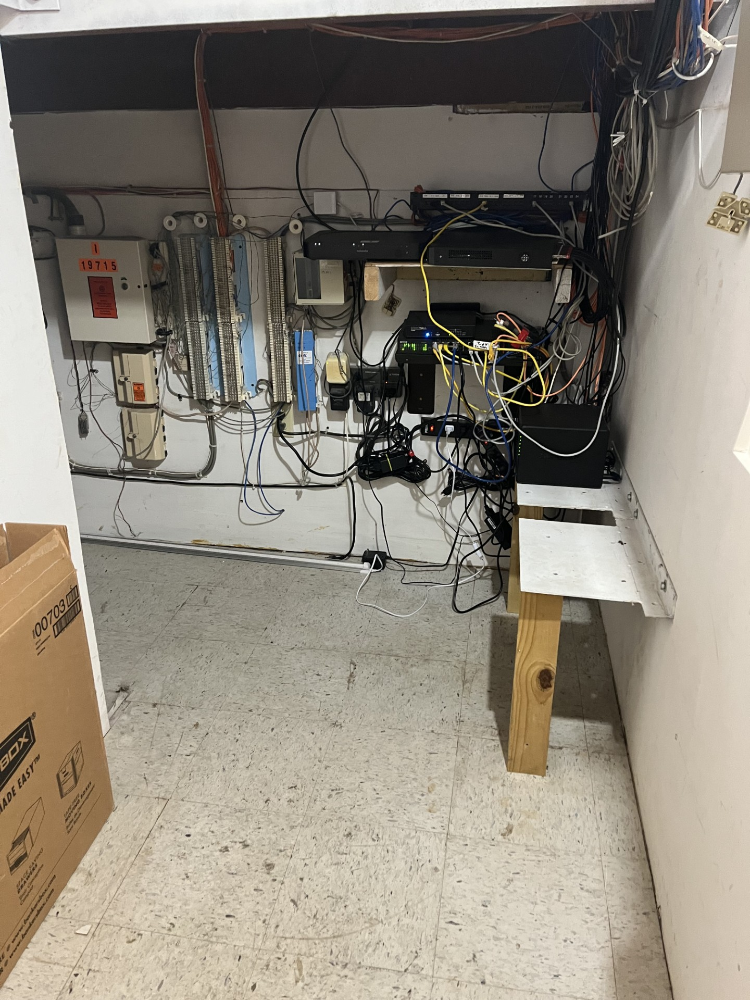
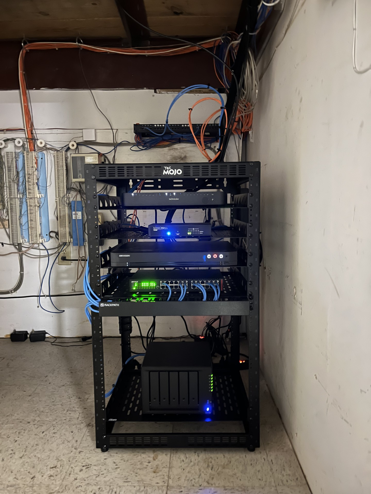
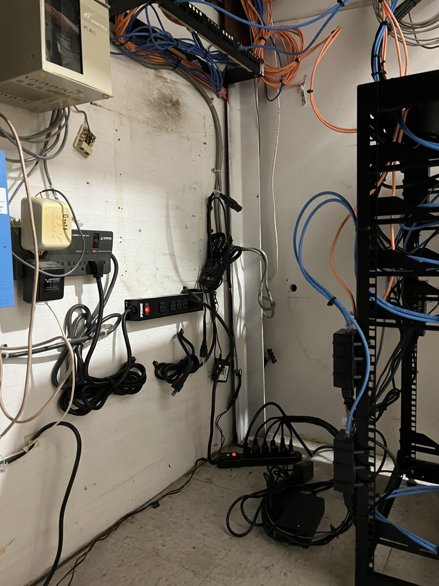
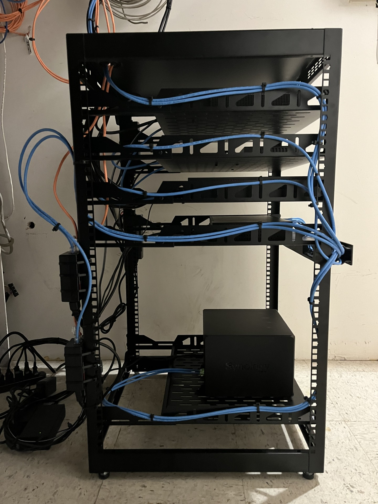
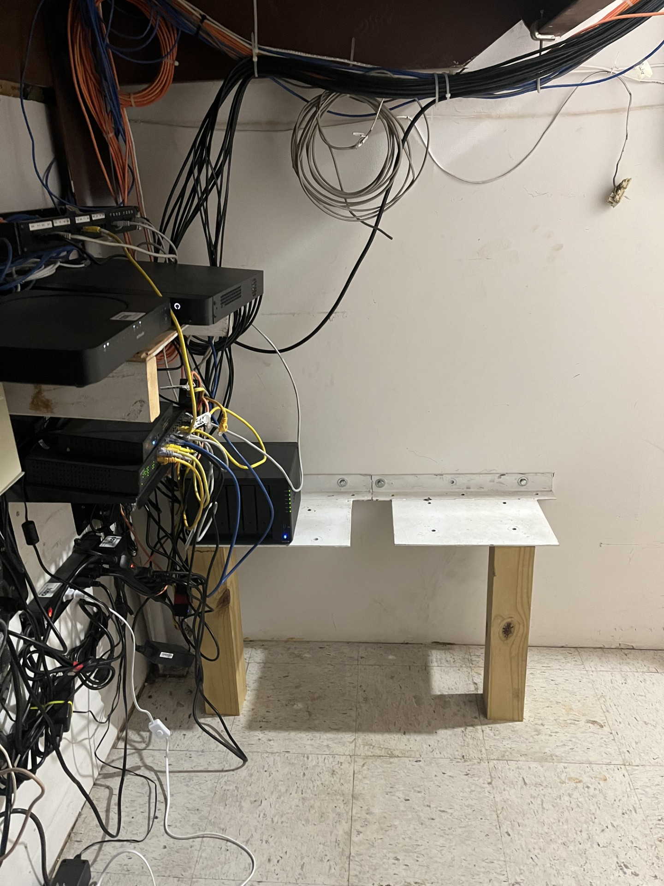

# Network Infrastructure Modernization

A workplace infrastructure modernization project that transformed an organically
grown network installation into a centralized, rack-based environment with
improved equipment accessibility, cable management, maintainability, and room
for future expansion.

---

## Before & After

<table>
<tr>
<td width="50%" align="center"><strong>Before</strong></td>
<td width="50%" align="center"><strong>After</strong></td>
</tr>
<tr>
<td width="50%">

</td>
<td width="50%">

</td>
</tr>
</table>

---

## Project Overview

When I joined the organization, the core network infrastructure had grown
organically over time without a dedicated equipment rack or structured physical
layout.

Networking, security, surveillance, storage, and supporting equipment were
distributed across improvised shelving and supports. Ethernet, power, and other
cabling had accumulated throughout the equipment area, making individual
devices difficult to access and connections difficult to trace.

The systems were operational, but the physical installation made
troubleshooting, maintenance, equipment replacement, and future expansion
unnecessarily difficult.

I redesigned the installation around a dedicated open-frame network rack,
consolidated the infrastructure, reorganized equipment placement, and rerouted
network cabling to create a significantly more maintainable environment.

---

## The Challenge

The existing infrastructure presented several practical issues:

- Network equipment was distributed across improvised shelves and supports.
- Some infrastructure was positioned close to the floor.
- Ethernet, power, and supporting cabling were heavily intermixed.
- Excess cable was distributed throughout the equipment area.
- Network connections were difficult to visually trace.
- Servicing one device could require working around unrelated equipment.
- There was little structure for future infrastructure expansion.

The objective was not simply to improve appearance. The installation needed to
become easier to understand, troubleshoot, maintain, and expand.

---

## My Role

I was responsible for evaluating the existing physical network installation and
redesigning it into a centralized rack-based infrastructure.

My work included:

- Assessing the existing equipment and physical layout
- Planning rack placement and equipment positioning
- Installing and organizing the network rack
- Relocating network and infrastructure hardware
- Rerouting Ethernet cabling
- Improving cable management and service access
- Consolidating supporting infrastructure
- Preserving serviceability for future maintenance
- Creating capacity for future network changes and expansion

---

## Solution

The redesigned installation centered the network environment around a dedicated
open-frame rack.

Major networking and infrastructure components were relocated into the rack,
providing a defined location for security, switching, surveillance, storage, and
Internet connectivity equipment.

Equipment was arranged vertically so individual devices could be more easily
identified, accessed, serviced, and replaced.

Ethernet cabling was rerouted through defined paths along the rack rather than
being allowed to cross randomly between equipment. Appropriate cable slack was
retained where necessary to preserve serviceability.

The resulting layout provides a clearer physical representation of the network
and substantially improves access to the infrastructure.

---

## Implementation

### Centralized Equipment

The new rack consolidates major infrastructure components into one managed
location, including:

- Internet gateway connectivity
- SonicWall network security appliance
- Ethernet switching infrastructure
- Hikvision surveillance recording equipment
- Synology network storage
- Patch and Ethernet cabling
- Supporting network and power equipment

### Cable Management

Network cabling was rerouted through the rack and secured along defined cable
paths.

This reduced loose cabling around the equipment area while preserving the
service loops necessary for maintenance and future changes.

### Equipment Accessibility

The rack layout allows individual devices to be reached without moving unrelated
hardware or working through large bundles of loose cable.

This makes routine troubleshooting, replacement, inspection, and expansion
significantly easier.

---

## Results

| Area | Before | After |
| --- | --- | --- |
| Equipment placement | Distributed across improvised supports | Centralized in a dedicated rack |
| Cabling | Loose and heavily intermixed | Routed through defined paths |
| Troubleshooting | Connections difficult to visually trace | Clearer physical connectivity |
| Maintenance | Limited equipment access | Individual devices readily accessible |
| Equipment protection | Infrastructure near floor level | Equipment elevated and rack organized |
| Expansion | No defined physical structure | Rack capacity available for future infrastructure |
| Serviceability | Changes could disturb unrelated equipment | Improved device-level access |

The modernization created a physical network environment that is easier to
understand, maintain, troubleshoot, and expand.

---

## Completed Installation

### Front View

The primary network infrastructure is consolidated into a single rack with clear
access to the major network, security, storage, and surveillance components.

### Side View

Network cabling follows defined paths along the rack while retaining sufficient
service loops for maintenance.

### Rear View

The rear and side of the rack remain accessible, allowing cabling and equipment
to be serviced without dismantling the installation.

---

## Original Installation

### Equipment Area

### Full Overview

The original infrastructure had accumulated over time across wall-mounted,
shelf-mounted, and improvised equipment locations with network and power
cabling distributed throughout the area.

---

## Technologies & Skills

`Network Infrastructure` ·
`Structured Cabling` ·
`Ethernet` ·
`Network Security` ·
`SonicWall` ·
`Network Switching` ·
`Synology NAS` ·
`Surveillance Infrastructure` ·
`Rack Infrastructure` ·
`Cable Management` ·
`Systems Administration` ·
`Troubleshooting`

---

## Project Takeaway

Reliable network infrastructure depends on more than device configuration.

Physical organization directly affects how quickly a network can be understood,
troubleshot, maintained, and expanded. Centralizing this environment into a
structured rack created a stronger physical foundation for the organization's
network infrastructure and made future changes substantially easier to manage.
